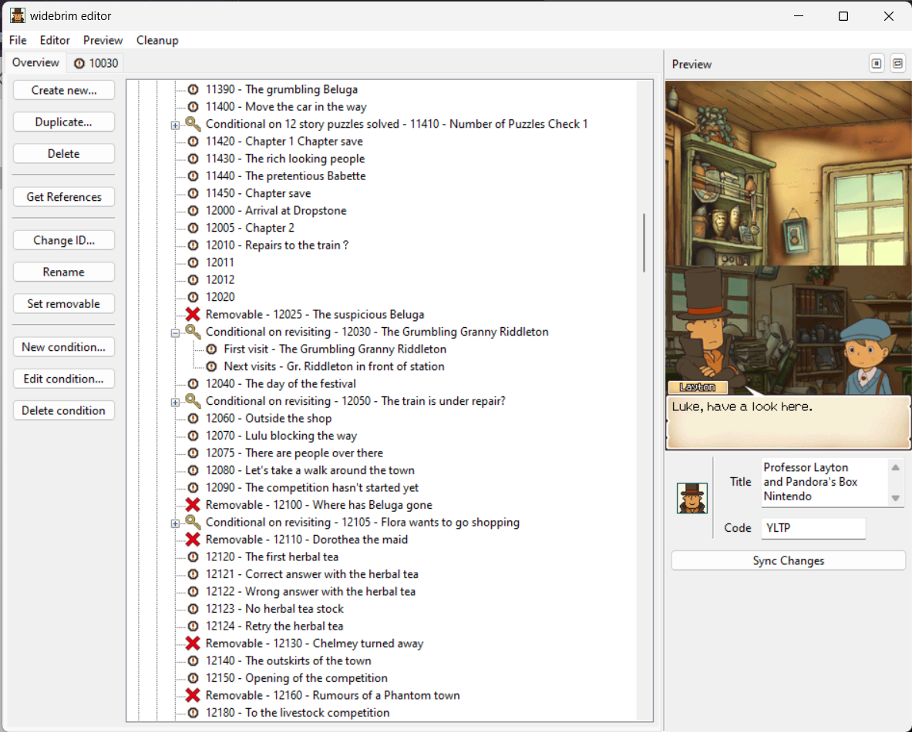
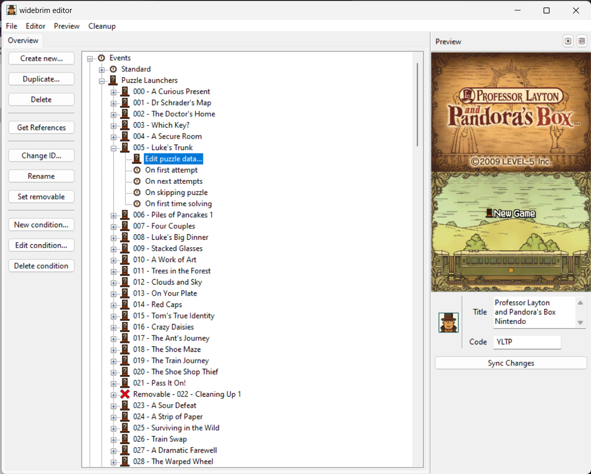
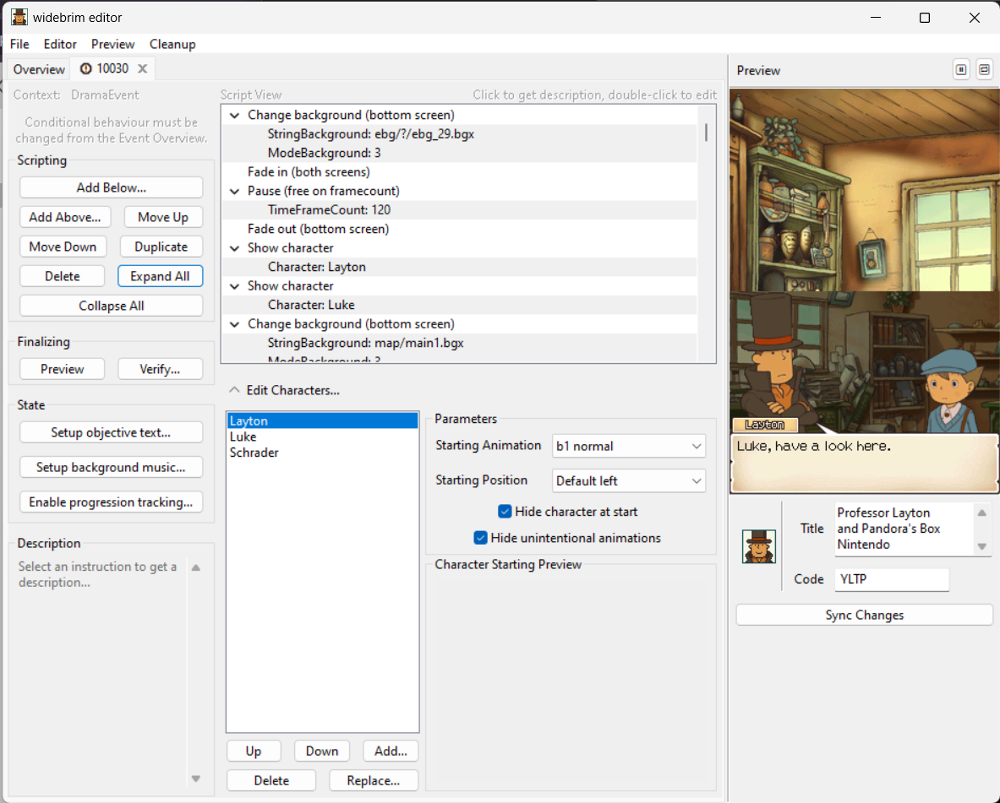
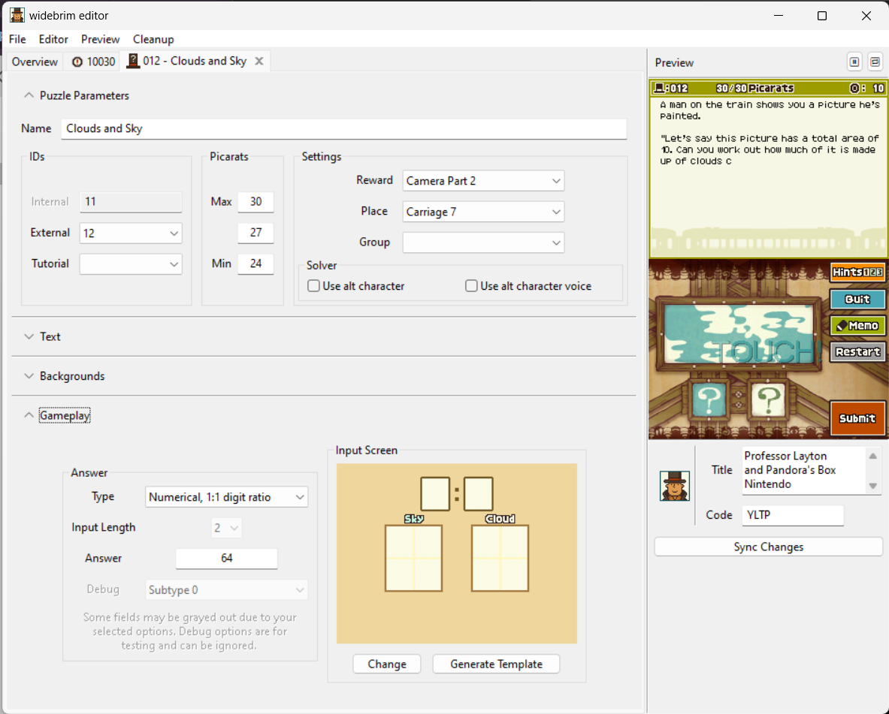
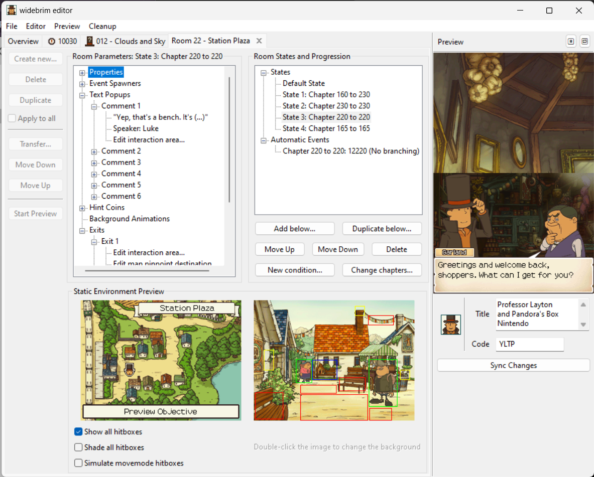

# widebrim editor
<p align="middle">
   
   
   <br>
   
   
   
   <br>
   <i>assets by Level-5, running in widebrim</i>
</p>

widebrim editor is a modding tool for customizing games built on the LAYTON2 (Professor Layton and the Diabolical Box) engine; live preview is powered by [widebrim](https://github.com/bullbin/widebrim) and asset handling by [madhatter](https://github.com/bullbin/madhatter).

## What can widebrim editor do right now?

As its primary objective is to make editing simple, widebrim editor aims to only ever expose simplified interfaces to reduce the need for internal knowledge of the engine. Since it's still a WIP, this is not possible with all features (yet) - the following tags describe our feature set:

 - High-level indicates the feature is present and simplified in the UI
 - Low-level indicates the feature is present but requires deeper knowledge of the engine to understand the UI
 - Not exposed to UI means that the internal library is capable of fulfilling this feature but it is not accessible yet
 - Not possible means the internal library does not support this feature yet
 - Not planned means that this is either low-priority or will not be a feature of the editor

|Category|Task|High-Level|Low-Level|Not Exposed to UI|Not Possible|Not Planned
|--|--|:--:|:--:|:--:|:--:|:--:|
|Filesystem|Creation|||✅
|Filesystem|Deletion|||✅
|Filesystem|Replacement|||✅
|Filesystem|ROM export|✅
|Filesystem|Virtual patching||||✅ (WIP)
|Imaging|Creation|✅
|Imaging|Deletion|||✅
|Imaging|Modification|||✅
|Animation|Creation|||✅
|Animation|Deletion|||✅
|Animation|Modification|||✅
|Database (Text)|Modification|✅~
|Database (Text)|Deletion||||✅
|Progression|Conditional marker editing|✅
|Progression|Text database editing|||✅~
|Rooms|Creation|✅
|Rooms|Deletion|✅
|Rooms|Duplication||||✅
|Rooms|Editing|✅
|Rooms|Conditional editing||✅
|Rooms|TObj editing|||✅
|Events|Creation|✅
|Events|Deletion|||✅
|Events|Duplication||||✅
|Events|Editing|✅
|Puzzles|Creation||||✅
|Puzzles|Deletion||||✅
|Puzzles|Duplication||||✅
|Puzzles|Editing||✅*
|Puzzles (*DrawInput)|Editing|✅
|Audio|Management|||||✅
|Movie|Management|||||✅
|Fonts|Editing||||✅|
|Minigames|Editing||||✅|
|Preview|Fast in-engine preview|✅
|Preview|Hot reload preview|||||✅

***TLDR**: widebrim editor does a lot but doesn't do enough right now for you to write a new game entry from scratch. Planned features include everything but minigames, fonts, audio and video.*

**widebrim editor is largely proof-of-concept right now. For more battle-tested editing and up-to-date features, we recommend trying [LaytonEditor](https://github.com/C3RV1/LaytonEditor).**

## How do I install this?
### Clone the repo completely
This repository uses nested submodules. Make sure that when you clone this repo, both the `widebrim/widebrim` and `widebrim/widebrim/madhatter` folders have contents. If not, init the submodules recursively after pulling.

### Install prerequisites
Start by installing the requirements for widebrim editor. Using a command line running in the same folder as the editor, run
```
pip install -r requirements.txt
```
As this uses widebrim, [follow widebrim's guide to install its prerequisites too](https://github.com/bullbin/widebrim?tab=readme-ov-file#how-do-i-install-this); optional requirements are recommended for a better editing experience.

## How do I use this?
You will need a copy of the ROM for Professor Layton and Pandora's Box (YLTP); other regions may work, but [not Asian regions](https://github.com/bullbin/widebrim/blob/main/README.md#are-there-any-known-limitations). **If it requires modifications to widebrim's default launcher to boot, it will probably not work.** Launch the editor by starting `preview.py`. 

On first boot, you will be prompted to agree to a brief EULA. It's nothing serious but it declares that **we don't take responsibility or liability for anything made with this tool. Don't do anything that LEVEL-5 wouldn't approve of.** Subsequent launches will give you the option to select your working ROM and launch the editor; **it is not recommended you use the empty ROM or virtual filesystem options as they are not ready yet. For now, all changes will be written to the working ROM**.

For actual usage, read the wiki!

## How do I credit mods made with this?
While not required, please reference widebrim editor somewhere in mods made with this tool - if you are particularly proud of what you've produced, **feel free to promote your title in an issue! Just don't distribute your ROM until VFS or patching is ready.** We'd love to see what people make with this!

## I broke it or want to suggest a feature!
**Please open a GitHub issue with the command line output and steps to reproduce!** If your issue is complex and part of several modifications to a ROM, it may require more detailed debugging to fix - please be patient and work with us.

**For feature suggestions, also open an issue.** Just make sure that your issue doesn't relate to features that won't be added.

## Any people to thank?
Same as [widebrim](https://github.com/bullbin/widebrim?tab=readme-ov-file#who-do-i-blame-in-case-you-get-sued)!
